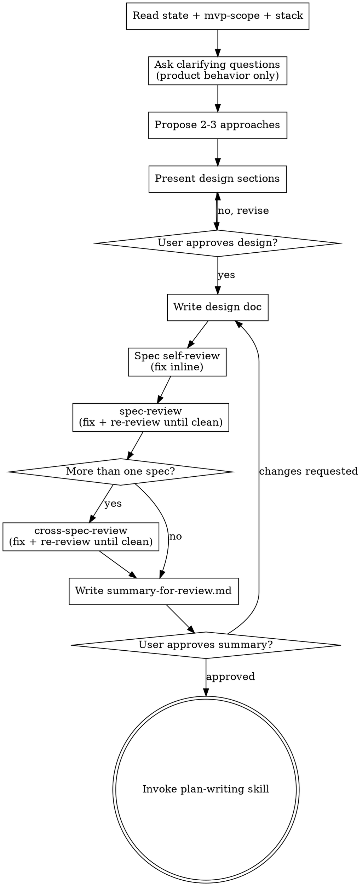

> Vendored from [obra/superpowers](https://github.com/obra/superpowers) v6.1.1 (commit d884ae04), MIT.
> Modifications: reworked from the upstream design-dialogue skill; input is approved MVP scope and stack; user questions restricted to product behavior; visual companion offer removed; terminal transition replaced with SPP review chain

# Brainstorming Ideas Into Designs

Help turn ideas into fully formed designs and specs through natural collaborative dialogue.

Start by understanding the current project context, then ask questions one at a time to refine the idea. Once you understand what you're building, present the design and get user approval.

<HARD-GATE>
Do NOT invoke any implementation skill, write any code, scaffold any project, or take any implementation action until you have presented a design and the user has approved it. This applies to EVERY project regardless of perceived simplicity.
</HARD-GATE>

## Anti-Pattern: "This Is Too Simple To Need A Design"

Every project goes through this process. A todo list, a single-function utility, a config change — all of them. "Simple" projects are where unexamined assumptions cause the most wasted work. The design can be short (a few sentences for truly simple projects), but you MUST present it and get approval.

## Checklist

You MUST create a task for each of these items and complete them in order:

1. **Explore project context** — read `pipeline-state.md`, `02-mvp-scope.md`, `03-stack.md`, plus files/docs/recent commits
2. **Ask clarifying questions** — one at a time, product behavior only: UX, copy/text, scenario edge-cases
3. **Propose 2-3 approaches** — with trade-offs and your recommendation
4. **Present design** — in sections scaled to their complexity, get user approval after each section
5. **Write design doc** — save to `docs/spp/04-specs/YYYY-MM-DD-<topic>-design.md` and commit
6. **Spec self-review** — quick inline check for placeholders, contradictions, ambiguity, scope (see below)
7. **spec-review** — invoke `super-puper-powers:spec-review`, fix Critical/Important findings, repeat until clean
8. **cross-spec-review** — if more than one spec exists, invoke `super-puper-powers:cross-spec-review`, fix findings, repeat until clean
9. **Write and get approval on the product summary** — write `docs/spp/04-specs/summary-for-review.md`, ask the user to approve the summary (not the full spec)
10. **Transition to implementation** — invoke the plan-writing skill to create the implementation plan

## Process Flow

**The terminal state is invoking `super-puper-powers:plan-writing`.** Do NOT invoke frontend-design, mcp-builder, or any other implementation skill. The ONLY skill you invoke after spec-writing is plan-writing.

## The Process

**Understanding the idea:**

- Read `docs/spp/pipeline-state.md`, `docs/spp/02-mvp-scope.md`, and `docs/spp/03-stack.md` before asking anything. These carry the approved scope, scenarios, and stack — do not re-ask what they already answer.
- User questions are restricted to product behavior only: UX, copy/text, and scenario edge-cases (what happens when the user does something unexpected). Never ask the user about architecture, data schema, or error handling — decide those yourself and record the decision in the spec with a justification (per the SPP principle that technical decisions are the agent's to make and document, not the user's to be asked).
- Before asking detailed questions, assess scope: if the request describes multiple independent subsystems (e.g., "build a platform with chat, file storage, billing, and analytics"), flag this immediately. Don't spend questions refining details of a project that needs to be decomposed first.
- If the project is too large for a single spec, help the user decompose into sub-projects: what are the independent pieces, how do they relate, what order should they be built? Then brainstorm the first sub-project through the normal design flow. Each sub-project gets its own spec → plan → implementation cycle.
- For appropriately-scoped projects, ask questions one at a time to refine the idea
- Prefer multiple choice questions when possible, but open-ended is fine too
- Only one question per message - if a topic needs more exploration, break it into multiple questions
- Focus on understanding: product behavior, constraints already fixed by the MVP scope and stack, success criteria

**Exploring approaches:**

- Propose 2-3 different approaches with trade-offs
- Present options conversationally with your recommendation and reasoning
- Lead with your recommended option and explain why

**Presenting the design:**

- Once you believe you understand what you're building, present the design
- Scale each section to its complexity: a few sentences if straightforward, up to 200-300 words if nuanced
- Ask after each section whether it looks right so far
- Cover: architecture, components, data flow, error handling, testing
- Be ready to go back and clarify if something doesn't make sense

**Design for isolation and clarity:**

- Break the system into smaller units that each have one clear purpose, communicate through well-defined interfaces, and can be understood and tested independently
- For each unit, you should be able to answer: what does it do, how do you use it, and what does it depend on?
- Can someone understand what a unit does without reading its internals? Can you change the internals without breaking consumers? If not, the boundaries need work.
- Smaller, well-bounded units are also easier for you to work with - you reason better about code you can hold in context at once, and your edits are more reliable when files are focused. When a file grows large, that's often a signal that it's doing too much.

**Working in existing codebases:**

- Explore the current structure before proposing changes. Follow existing patterns.
- Where existing code has problems that affect the work (e.g., a file that's grown too large, unclear boundaries, tangled responsibilities), include targeted improvements as part of the design - the way a good developer improves code they're working in.
- Don't propose unrelated refactoring. Stay focused on what serves the current goal.

## After the Design

**Documentation:**

- Write the validated design (spec) to `docs/spp/04-specs/YYYY-MM-DD-<topic>-design.md`
  - (User preferences for spec location override this default)
- Use elements-of-style:writing-clearly-and-concisely skill if available
- Commit the design document to git

**Spec Self-Review:**
After writing the spec document, look at it with fresh eyes:

1. **Placeholder scan:** Any "TBD", "TODO", incomplete sections, or vague requirements? Fix them.
2. **Internal consistency:** Do any sections contradict each other? Does the architecture match the feature descriptions?
3. **Scope check:** Is this focused enough for a single implementation plan, or does it need decomposition?
4. **Ambiguity check:** Could any requirement be interpreted two different ways? If so, pick one and make it explicit.

Fix any issues inline. No need to re-review — just fix and move on.

**spec-review:**
After the self-review passes, invoke `super-puper-powers:spec-review`. It dispatches a clean-context subagent that checks the spec against the MVP scope: every must-scenario covered, no contradictions, no ambiguity (an interpretation that could go two ways is a defect), nothing infeasible on the chosen stack, no placeholders. Fix every Critical and Important finding, then re-invoke spec-review. Repeat until it comes back clean.

**cross-spec-review:**
If the project decomposed into more than one spec, invoke `super-puper-powers:cross-spec-review` once every spec has passed its own spec-review. It checks interface consistency across sub-projects, seam gaps, contradictions, and build order. Fix Critical and Important findings, re-invoke, repeat until clean. It also records the recommended sub-project build order (`subproject_order`) for plan-writing and phase 6 to consume — don't skip it if there's more than one spec.

**Product Summary Gate:**
Once spec-review (and cross-spec-review, if applicable) passes clean, write `docs/spp/04-specs/summary-for-review.md` in product language, not spec language:

- Scenarios as "user does X → Y happens"
- Screens or commands described in words, not diagrams or code
- What happens on typical errors

Then ask the user to approve the summary — not the full spec:

> "Here's what the product will do: `<path to summary-for-review.md>`. Take a look and let me know if this matches what you want before we move to planning. You don't need to read the full spec — the summary covers what matters to you."

Wait for the user's response. If they request changes, make them in the spec, re-run spec-review (and cross-spec-review) as needed, update the summary, and ask again. Only proceed once the user approves the summary.

**Implementation:**

- Invoke `super-puper-powers:plan-writing` to create a detailed implementation plan
- Do NOT invoke any other skill. plan-writing is the next step.

## Key Principles

- **One question at a time** - Don't overwhelm with multiple questions
- **Multiple choice preferred** - Easier to answer than open-ended when possible
- **YAGNI ruthlessly** - Remove unnecessary features from all designs
- **Explore alternatives** - Always propose 2-3 approaches before settling
- **Incremental validation** - Present design, get approval before moving on
- **Be flexible** - Go back and clarify when something doesn't make sense
